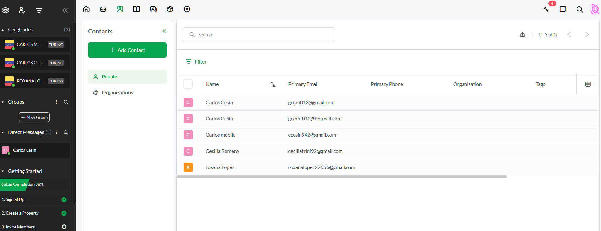
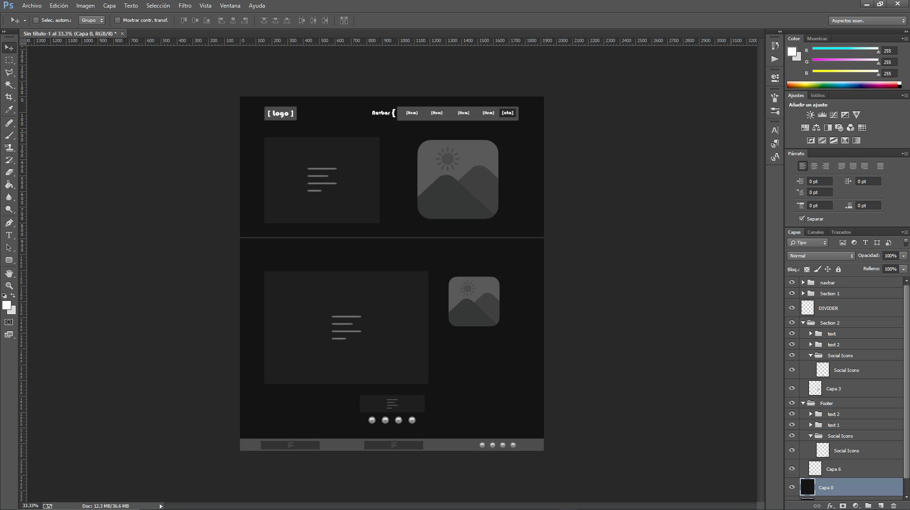
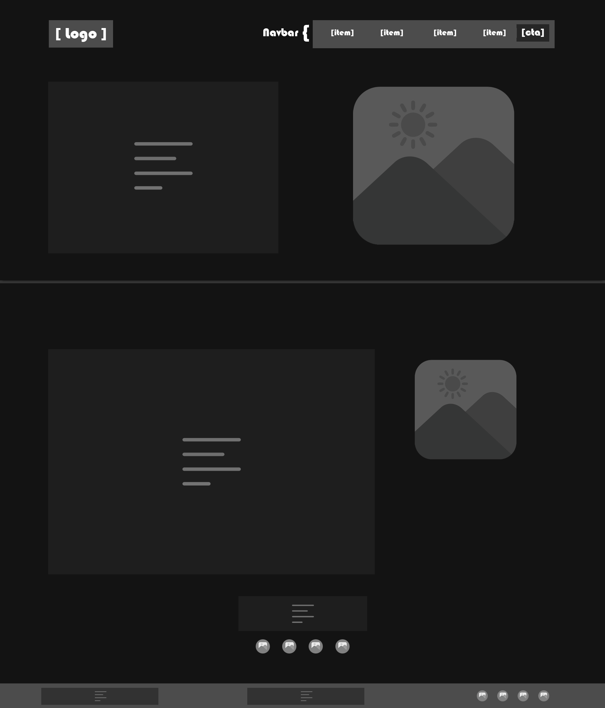
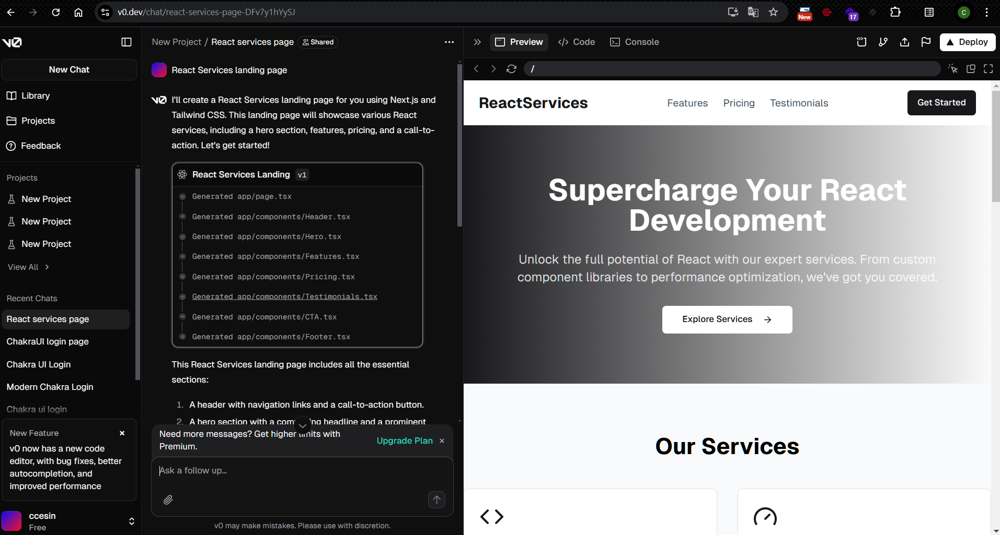
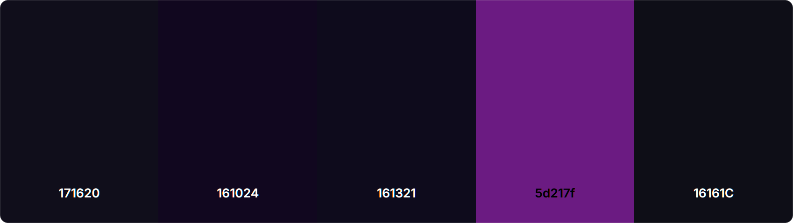
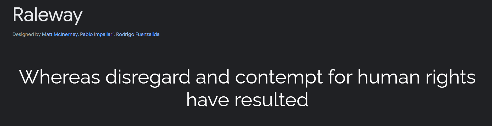

# Proceso de Desarrollo 

## Herramientas de IA utilizadas
Este proyecto fue desarrollado utilizando las siguientes tecnologias de inteligencia artificial:

### BlackBox.ai
- <a src="https://www.blackbox.ai/">BlackBox.ai</a> | Chat
    
    
    

### BlackBox.ai Cyber Coder
- <a src="https://marketplace.visualstudio.com/items?itemName=Blackboxapp.blackbox">BlackBox.ai Cyber Coder</a> | (VsCode Copilot [ Auto generar codigo y documentacion tecnica | Traducciones | Etc... ] )
    
    
    

### Canva
- <a src="https://www.canva.com/ai-image-generator/">Canva</a> | IA generativa de imagenes y logos
    
    
    
    
    

### TawkTo
- <a src="https://www.canva.com/ai-image-generator/">TawkTo</a> | Plataforma de gestion de chat, tickets, leads y soporte con asistente de IA
    
    
    
    
    
    

## Beneficios de usar IA
Al utilizar IA en el desarrollo de mi landing page con herramientas como BlackBox.ai, BlackBox.ai Cyber Coder, Canva y TawkTo, he experimentado varios beneficios significativos. 

- **Eficiencia en la codificación**: Primero, he notado un aumento en la eficiencia, ya que BlackBox.ai me ayuda a generar código rápidamente, lo que reduce el tiempo de desarrollo en un 20%. 

- **Generación de CANVA**: Canva me permite crear diseños atractivos de manera intuitiva asi como generar imagenes y logos con su herramienta de IA de manera automática.

- **Asistente virtual e IA TawkTo**: El asistente con IA de TawkTo facilita la interacción con los usuarios, mejorando la experiencia general, esto gracias a que pude entrenarlo para gestionar problemas e informacion especifica en el contexto de lo q es mi landing page y mis servicios ofertados . 

En conjunto, estas herramientas han optimizado mi flujo de trabajo y han elevado la calidad de mi landing page.

## Restricciones de usar IA
Al utilizar BlackBox.ai, BlackBox.ai Cyber Coder, Canva y TawkTo en mi landing page, he encontrado algunas desventajas.

- **Limitaciones en la calidad del código**: A veces, BlackBox.ai genera código que no es óptimo, lo que me obliga a realizar revisiones adicionales para asegurarme de que funcione correctamente.

- **Falta de personalización en Canva**: Aunque la IA de Canva es intuitiva y fácil de usar, me he dado cuenta de que limita la personalización avanzada de los diseños, lo que puede ser frustrante si busco algo más específico o único, y para poder acceder a una mejor calidad de la IA generativa, hay q consum,ir la version de Pago (Al igual q todas las demas IAs de esta tipo).

- **Interacción intrusiva de TawkTo**: TawkTo puede resultar intrusivo si no se configura adecuadamente, lo que puede afectar negativamente la experiencia del usuario en mi landing page (Cosa que resolvi entranando la IA), ademas, al igual q las demas herramientas de este tipo, se debe acceder a una version PRO para poder tener acceso a todas las funcionalidades de la IA.

- **Dependencia de herramientas**: He notado que la dependencia de estas herramientas puede llevar a una reducción en mis habilidades de codificación y diseño a largo plazo, ya que me acostumbro a depender de la IA para tareas que antes realizaba manualmente.

## Código fuente
El código fuente de mi landing page se encuentra en el siguiente enlace: 

- **⚙️[Código Fuente](https://github.com/Ccesin/ReactTest).**

## Diseño de la Landing Page
La landing page la diseñé con la herramienta de diseño Photoshop, para definir un Mockup base, y con la herramienta de IA de Canva para generar los componentes o elementos visuales de la landing page, como imagenes y logos.

- **Diseño de Mockup**

- **Mockup Definido como BASE**

- **Gereacion de plantilla de REACT.JS con Vercel**
Por tematica de tiempo, decidi implementar un template de React.js que se adecuo al mockup de landing page. Para esto utilice ⚙️[VERCEL](https://github.com/Ccesin/ReactTest)

- **Definicion de estética**
A medida que avance con el desarrollo de la landing page, y edicion del template, fui tomando decisiones con respecto de los colores, tipografia y otros elementos visuales para que se ajustaran a una estetica moderna y limpia.

- Paleta de Colores:

- Fuente de Tipografia: Raleway

