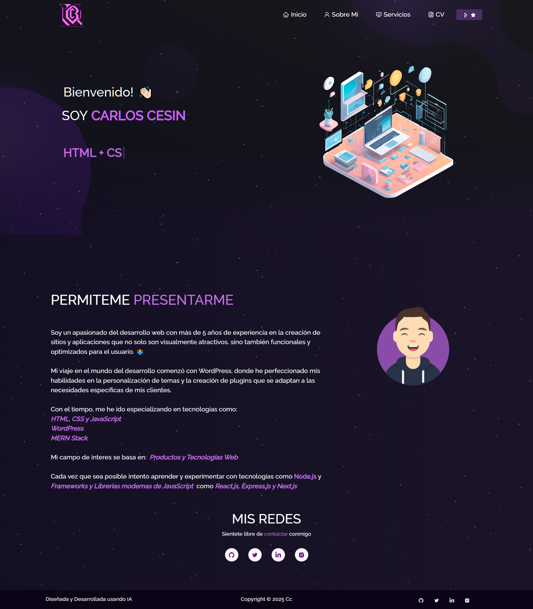

<h2 align="center">
  Desarrollo Web - Materia Electiva UNEG
   
  Evaluacion #6 - Examen
</h2>

  
   
  

 

## Documentación Solicitada
A continuacion la documentación solicitada en los requerimientos del proyecto: 

- **⚙️[Guia de Usuario](https://github.com/Ccesin/ReactTest/blob/main/Guia-de-Usuario.md).**
- **⚙️[Presentacion](https://github.com/Ccesin/ReactTest/blob/main/Presentacion.md).**

 

## Tecnologias implementadas

Este proyecto fue desarrollado utilizando las siguientes tecnologias:

- React.js
- Node.js
- Express.js
- CSS3
- VsCode
- Vercel

## Features

**📖 Multi-Page Layout**

**🎨 Estilizado con React-Bootstrap y Css con facilidad para gestionar colores**

**📱 Completamente Responsivo**
