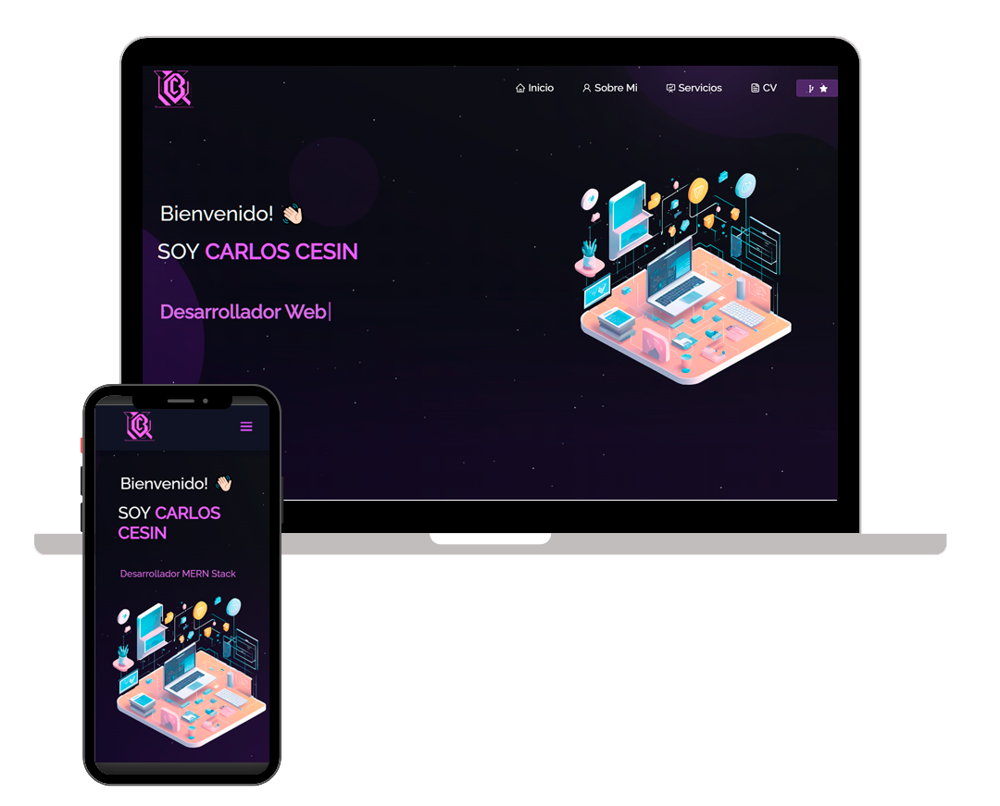

<h2 align="center">
  Desarrollo Web - Materia Electiva UNEG
   
  Evaluacion #6 - Examen
</h2>

  

 

## Desarrollado Con

Este proyecto fue desarrollado utilizando las siguientes tecnologias:

- React.js
- Node.js
- Express.js
- CSS3
- VsCode
- Vercel

## Features

**📖 Multi-Page Layout**

**🎨 Estilizado con React-Bootstrap y Css con facilidad para gestionar colores**

**📱 Completamente Responsivo**

## IAs Utilizadas

Este proyecto fue desarrollado utilizando las siguientes tecnologias de inteligencia artificial:

- <a src="https://www.blackbox.ai/">BlackBox.ai</a> | Chat
-- 
-- 
-- 
- <a src="https://marketplace.visualstudio.com/items?itemName=Blackboxapp.blackbox">Cyber Coder</a> | (VsCode Copilot)
-- 
- <a src="https://www.canva.com/ai-image-generator/">Canva</a> | IA generativa
-- 
-- 
-- 
